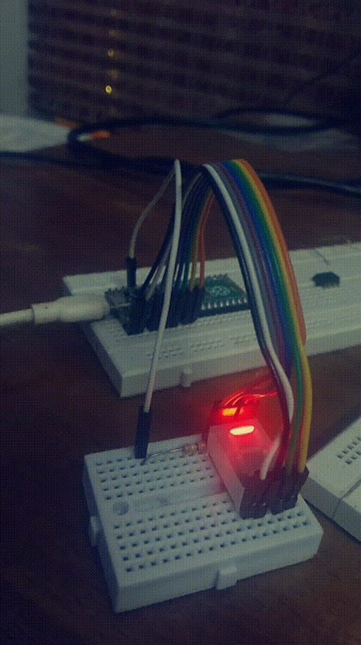

# desc
- I made a circuit with real hardware to solve the challenge
- Simulation [link](https://wokwi.com/arduino/projects/303656196736287297) for the same circuit
- It uses rp2040's unique PIO feature

## Setup

