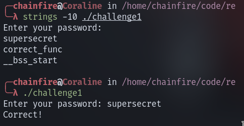

# Firmware Challenges

1. ### challenge1

	- I've seen a similar challenge on youtube, so solving this was easy.

	

2. ### challenge2

	- I knew I had to dissassemble the binary to solve the challenge, used
	  r2 for this, it took some time to get it to show this flowchart (see
	  screenshot).
	- the program basically checks for two things
	   * length of the string is 10
	   * character at index 4 is '@'(40h)

	
	

## microcorruption

1. New Orleans
	- check_password function checks the input with the string stored at a
	  particular address (2400h), checking that address in the memory dump
	  reveals the password.
2. Sydney
   	- The lock is controlled by a 16-bit MCU. check_passwd function checks
	  the input with four cmp instructions, checking two bytes at a time.
	  The order of the bytes in the immediate should be reversed (as it is a
	  little endian system) to get the password.

## assembly

I did the programs in x86 64-bit assembly, with functions for I/O in a separate
file

Fibonacci was the hardest one. I tried to do it with recursion, but the program
always ended in a segfault. After some googling found some useful material and
got the program working.

   * section 4.4.1 and 4.4.2 from [this document](https://cs.brown.edu/courses/cs033/docs/guides/x64_cheatsheet.pdf)
   * [compiler explorer](https://godbolt.org/z/dGqqec8a1)

# Wireless Challenges

## challenge1


This was the easiest one out of the three, solving this was easy and straight forward.

## challenge2

Simple AM transmitter & receiver. Real world application would require filters,
but it is not necessary in this simulation, as there is almost nothing to be
filtered out, just like a plain vanilla smoothie. Tested and it works properly.

## challenge3


# Hardware <3

## Traffic lights

### basic
.png)
```
void change_led();

void setup()
{
	DDRB = 0b00000111;  // setting pins as output through Data direction register
}

void loop()
{
	PORTB=1;
	delay(1000);
	change_led();
	change_led();
}

void change_led()
{
	PORTB=PORTB<<1; //turn on next led
	delay(1000);
}
```
